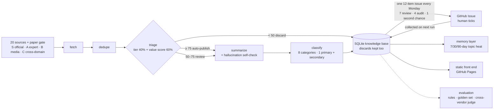
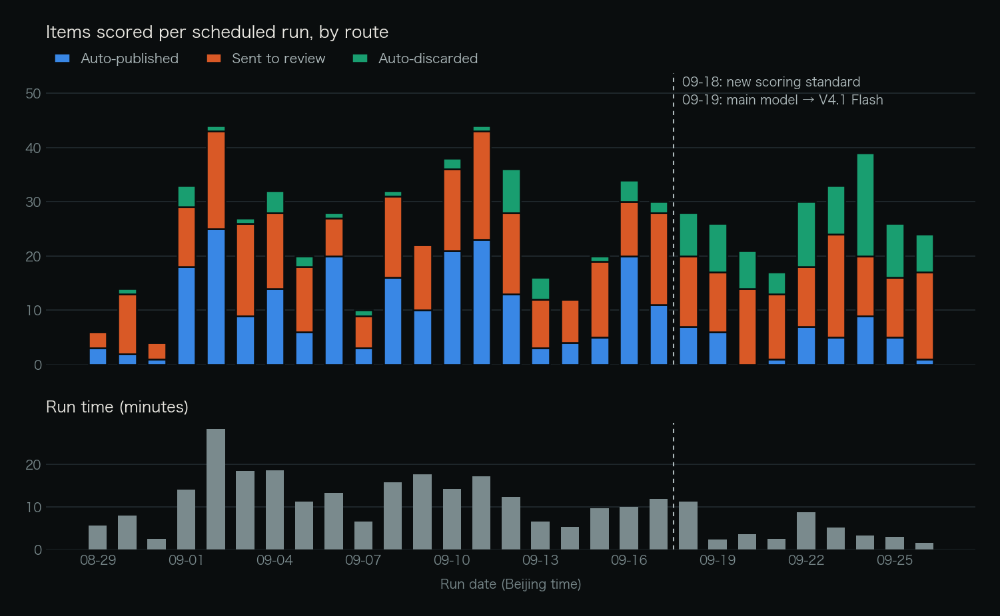

<div align="center">


**AIRadar · A daily scheduled AI-industry intelligence workflow**

Tiered sources → a fixed six-step pipeline → three routes by score (high scores auto-publish · uncertain items go to a weekly human review · low scores are discarded but kept on record) → a searchable AI-industry knowledge base

<p>
<a href="README.md">中文</a> &middot;
<strong>English</strong> &middot;
<a href="https://wenboxia.github.io/airadar/"><strong>Live site</strong></a> &middot;
<a href="#quick-start">Quick start</a> &middot;
<a href="#architecture">Architecture</a> &middot;
<a href="#evaluation">Evaluation</a> &middot;
<a href="#run-data">Run data</a> &middot;
<a href="docs/decisions.md">Design decisions</a>
</p>

[](https://github.com/wenboxia/airadar/actions/workflows/daily.yml)
[](https://github.com/wenboxia/airadar/commits/main)
[](LICENSE)
[](https://wenboxia.github.io/airadar/)

</div>

<p align="center">
  
  <br>
  <sub>The live site's This Week view (UI in Chinese): top picks plus the full list. In the radar on the right, closer to the center means more trustworthy; color separates time-sensitive news from long-term value. Data as of the 2026-09-25 scheduled run.</sub>
</p>

<details>
<summary><kbd>Contents</kbd></summary>

- [How it works](#how-it-works)
- [Models](#models)
- [What it solves](#what-it-solves)
- [Six mechanisms](#six-mechanisms)
- [Architecture](#architecture)
- [Evaluation](#evaluation)
- [Run data](#run-data)
- [What AIRadar is not](#what-airadar-is-not)
- [Quick start](#quick-start)
- [Verify it yourself](#verify-it-yourself)
- [FAQ](#faq)
- [Design decisions](#design-decisions)
- [Related projects](#related-projects)

</details>

## How it works

| Step | What happens | Example (the 09-25 run) |
|---|---|---|
| **01 Fetch and score daily** | GitHub Actions triggers at 05:00 Beijing time, fetches originals from 20 tiered sources plus a paper gate, and the model gives each item a three-dimension value score | 48 items fetched, 24 left after dedupe |
| **02 Route by score** | Combined score = source tier 40% + value score 60%. ≥ 75 auto-publish, 50–75 go to human review, < 50 discarded but kept on record | 1 auto-published · 16 to review · 7 discarded |
| **03 A human signs off weekly** | Every Monday a 12-item GitHub issue opens: 7 review candidates (tick = accept) · 4 audit samples of auto-published items (tick = **retract**) · 1 second-chance item. Closing the issue submits; the next run collects it | Approval issue #4: 2 accepted, 2 retracted (screenshot under [Architecture](#architecture)) |

## Models

| Role | Model | Job |
|---|---|---|
| Main | DeepSeek V4.1 Flash | Scoring, summaries, classification, summary self-check |
| Fallback | GLM-5.3 | Takes over automatically when the main model fails permanently — a different vendor on purpose |
| Judge | Kimi K3 | Evaluation only: checks whether summaries are faithful to the source, 3 votes per item. A different vendor from the main model, to avoid a model grading itself |

## What it solves

| The usual problem with AI news | What AIRadar does |
|---|---|
| Hundreds of items a day, no idea who to trust | Sources are tiered by what they are (official / expert / media / cross-domain); the tier sets the base score. Sources evaluated and rejected are kept in the registry with the reason |
| Full automation mis-publishes; full manual review doesn't scale | High scores publish automatically, uncertain items go to a human who sees only 12 a week. The human retracts mistakes and rescues misses instead of rubber-stamping each item |
| Read it, forget it | Published items settle into a searchable knowledge base; time-sensitive news drops out after 14 days, long-term items stay |
| "It got better" with no evidence | A 111-item golden set judged by the author, scored separately on the three routes: auto-publish / auto-discard / sent to review |

## Six mechanisms

<table>
<tr>
<td width="33%" valign="top">

### 📡 Source tiers
20 sources + 1 paper gate in four tiers: **S official 90 / A expert 78 / B media 62 / C cross-domain 48** — the tier is the base score. 3 sources evaluated and not fetched sit in tier X with written reasons.
<br><sub>[`sources.yaml`](pipeline/sources.yaml)</sub>

</td>
<td width="33%" valign="top">

### ⚖️ Three-dimension score → three routes
The model scores relevance / novelty / long-term value (0.25 / 0.25 / 0.5); marketing copy and knock-offs are capped. The combined score sets the route: **≥ 75 publish · 50–75 review · < 50 discard (kept)**.
<br><sub>[`triage.py`](pipeline/stages/triage.py)</sub>

</td>
<td width="33%" valign="top">

### 🧑‍⚖️ Weekly approval issue
12 items every Monday: **7 review · 4 audit · 1 second chance**. Audit items are sampled uniformly from auto-published ones — the only unbiased human feedback in the project. Stale issues are labelled before closing, so unticked items never count as rejections.
<br><sub>[`hitl.py`](pipeline/hitl.py)</sub>

</td>
</tr>
<tr>
<td width="33%" valign="top">

### 🛟 Three fallback chains
Content: direct fetch → Jina Reader → RSS summary. Model: DeepSeek → GLM → mark unavailable. Business: with no model, S/A tiers pass and the rest go to review. **Fallbacks only ever tighten.**
<br><sub>[`guards.py`](pipeline/guards.py) · [`llm.py`](pipeline/llm.py)</sub>

</td>
<td width="33%" valign="top">

### 🗂️ Layered memory
This week / knowledge base / trends. Time-sensitive items leave the knowledge base after 14 days; items a human accepted never expire. With less than 21 days of data, no trend verdicts.
<br><sub>[`memory.py`](pipeline/memory.py)</sub>

</td>
<td width="33%" valign="top">

### 🧱 Structural guards
Don't give the model what you don't want it to use: the summarizer never sees the source name. The model used to write the source as the publisher; a written ban didn't stop it, removing the field did.
<br><sub>[`summarize.py`](pipeline/stages/summarize.py)</sub>

</td>
</tr>
</table>

## Architecture



No servers: fetching and scoring run in GitHub Actions, data is committed back to the repo, and the front end is a static site. The LLM has no web access; it only processes originals fetched by code.

> **Why "workflow", not "agent"**
> Anthropic's *[Building effective agents](https://www.anthropic.com/engineering/building-effective-agents)* distinguishes workflows, where the steps follow predefined code paths, from agents, where the model decides its own process and tools.
> AIRadar's step order is fixed in [`pipeline/main.py`](pipeline/main.py); the model only scores, summarizes, classifies and self-checks — no tool calls, no loops. It is **prompt chaining + routing**.
> That's deliberate: fixed steps can be evaluated one by one and degrade by rule. ([D49](docs/decisions.md#d49), Chinese)

<p align="center">
  
  <br>
  <sub>Real approval issue #4 (audit and second-chance sections, in Chinese). A filled grey box = ticked. In the audit section a tick means <b>retract</b> — the opposite of the other two. Closing the issue submits; the next run collects it.</sub>
</p>

<details>
<summary>Screenshot of the site's Mechanism page</summary>
<br>

</details>

## Evaluation

| What | How | Current result | Script |
|---|---|---|---|
| Data integrity | Field and status checks on every run | 824 items, 0 violations (09-25) | [`run_eval.py`](evals/run_eval.py) |
| Scoring and routing | 111-item golden set judged by the author, agreement computed per route | See table below | [`triage_prompt_eval.py`](evals/triage_prompt_eval.py) |
| Classification | ① Same prompt, same 100 items, classified twice: primary-category agreement (noise floor)<br>② OpenAI / Anthropic's own feed tags as reference | Agreement 93% (V4.1 Flash)<br>Primary hit 88% (195 items sampled) | [`classify_stability.py`](tools/classify_stability.py) · [`feed_tag_eval.py`](evals/feed_tag_eval.py) |
| Summary faithfulness | A different vendor's model (Kimi) as judge, 3 votes per item | Early sample: 2 of 8 unfaithful; in model selection V4 Pro 0/8, V4.1 Flash 1/9 | [`judge_hallucination.py`](evals/judge_hallucination.py) · [`summary_model_eval.py`](evals/summary_model_eval.py) |
| Model selection | Six models paired on the same golden set: completion rate, accuracy, latency, cost | V4.1 Flash chosen: ties V4 Pro on classification, ~3× faster, misses 2 more in scoring | [`eval_report.md`](docs/eval_report.md) (Chinese) |

**Golden set v2**: 111 human judgments (39 accepted). The system has three outputs, so the three routes are scored separately rather than with binary precision / recall:

| System decision | 09-16 scoring standard | New standard · V4 Pro | New standard · V4.1 Flash (current) |
|---|---|---|---|
| Auto-published that I agree with | 62% (37) | **64%** (33) | 73% (26) |
| Auto-discarded that I'd also discard | 95% (20) | **98%** (42) | 93% (46) |
| Sent to review that I end up accepting | 28% (54) | **47%** (36) | 44% (39) |

The review hit rate rose from 28% to 44–47% not by moving thresholds but by making the scoring standard and the inclusion standard the same: scoring used to ask "how close is this to the focus areas", while my labels asked "first-hand or rehash, marketing copy or not, is there a reusable method".
With V4.1 Flash, missed items went from 1 to 3 (all just under the review line); thresholds were not tuned for them — that would be tuning on the test set. Samples are small (intervals around ±15 points), so read direction only. ([D45](docs/decisions.md#d45) · [D48](docs/decisions.md#d48), Chinese)

<details>
<summary><strong>How the golden set was labelled (including AI assistance)</strong></summary>
<br>

**All 100 accept / reject calls are mine, made out loud**: I labelled while talking to ChatGPT in voice mode — it read the material and checked sources, I said accept or not and why, and it filled in the form. The other 11 items are reused from the retired v1.
The system being evaluated is itself a model scoring content, so the answer key can't come from a model too. What happened is recorded as is:

- ChatGPT's filled-in reasons added things I never said in 94 of 100 items, so reasons were re-extracted from the chat log in my own words, with the concrete facts it raised added and **each addition sourced** ([`golden_v2_extraction.json`](evals/golden_set/golden_v2_extraction.json))
- It voiced a leaning on 42 items, 33 of them before I spoke (`ai_recommended_first`); on 4 I explicitly said "use your reason". Dropping those 4, the three metrics barely move under the 09-16 standard (auto-publish 64%, auto-discard 95%, review 27%)
- 9 items had also been labelled in v1; my two judgments agree on 8

The models that wrote the background material (Kimi / GLM) are deliberately from different vendors than DeepSeek, which does the scoring. Standards and version history: [`evals/golden_set/README.md`](evals/golden_set/README.md) (Chinese). ([D42](docs/decisions.md#d42))

</details>

<details>
<summary><strong>Classification details</strong></summary>
<br>

Eight flat categories: models / agents & dev / evaluation / safety / products & applications / industry / open-source projects / research papers; the last two are decided from the link. Both acceptance lines were set before running:

| What | How | Result |
|---|---|---|
| Noise floor | Same prompt, same 100 items, classified twice; primary-category agreement | Old 13 categories 73% → new 8 categories **94%** (bar 85%); current V4.1 Flash **93%** |
| Accuracy | OpenAI / Anthropic feed tags as reference, 18 tags, 195 items | Primary hit **88%** (same for V4 Pro and V4.1 Flash) |

Part of the 94% comes from having fewer categories, not only from better boundaries. In the first version (84%) the weakest tag was OpenAI's Global Affairs (33%) — an OpenAI department name whose bank and country-partnership stories belong under products & applications by our boundaries. The mapping was not changed after the run; changing it would be tuning the standard to the answers. After the boundary fix, the weakest tag in both 88% runs became AI Adoption.

The first boundary text put "company X built Y with model Z" (customer stories like Cursor and Warp) under agents & dev. The fix was checked on **a fresh sample with a paired comparison** (86% → 88%, all 4 named items moved), because the change came from the first sample's errors and re-testing on the same sample would be tuning on the test set. ([D43](docs/decisions.md#d43))

</details>

## Run data

As of the 2026-09-25 (UTC) scheduled run, generated by [`tools/run_stats.py`](tools/run_stats.py) from `data/runs/` run by run, counting only cloud scheduled runs (no local debugging); re-run it to refresh.

| Metric | Value |
|---|---|
| Scheduled runs | 29, all successful (2026-08-29 → 09-25, GitHub Actions records) |
| Fetched → kept after dedupe | 1,457 → 746 (49% filtered) |
| Routes | auto-published 268 · sent to review 355 · auto-discarded 123 |
| LLM calls | 2,158 calls, 4.35M tokens |
| Fallback to backup model | 77 calls (3.6%), in 27 of 29 runs |
| Non-fatal errors | 30, all single-source fetch failures; none blocked the pipeline |
| Run time | median 9.8 min: V4 Pro period (21 runs) 11.8 min, V4.1 Flash period (8 runs) 3.2 min |
| Knowledge base | 317 published, 82 time-sensitive items expired by rule |
| Regression tests | 128 |

<p align="center">
  
  <br>
  <sub>The new scoring standard took effect on 09-18 (Beijing time) and the main model switched to V4.1 Flash on 09-19 — one run apart, so the rise in discards and drop in run time can't be credited to the model alone.</sub>
</p>

## What AIRadar is not

| Not | Why |
|---|---|
| Not an agent | Steps are fixed in code; the model makes no tool calls and runs no loops ([D49](docs/decisions.md#d49)) |
| No web search by the model | Fetching is done by code from a source allowlist; the model only sees what was fetched — originals are stored, hallucinations checkable ([D2](docs/decisions.md#d2)) |
| Not a chatbot | A static site with no backend; chat Q&A would need a server and break the serverless design ([D3](docs/decisions.md#d3)) |
| Not fully automatic | Uncertain items go to a human, who sees only 12 a week ([D44](docs/decisions.md#d44)) |
| Not a multi-agent newsroom | Evaluated: the real bottleneck is review volume and scoring taste, not a missing reporter that roams on its own ([D50](docs/decisions.md#d50)) |
| Doesn't fetch papers by author | Measured: 4 well-known authors, 18 papers in 90 days, none being discussed; papers enter only when mentioned elsewhere ([D36](docs/decisions.md#d36)) |

Decision records are in Chinese.

## Quick start

**Look**: open the [live site](https://wenboxia.github.io/airadar/) — six views: this week / today / knowledge base / trends / review / mechanism (UI in Chinese).

**Review**: issues labelled `airadar-approval` are the weekly approval issues — [all of them here](https://github.com/wenboxia/airadar/issues?q=label%3Aairadar-approval).

**Run**:

```bash
pip install -r requirements.txt
python3 -m pipeline.main --no-llm --limit 3   # no API key needed: runs the whole pipeline on the fallback path (writes to data/)
python3 -m unittest discover evals            # 128 regression tests
cd web && npm install && npm run dev          # front end
```

<details>
<summary>Deploy your own</summary>
<br>

1. Fork the repo and set the three model roles under Settings → Secrets and variables → Actions: main `AIRADAR_LLM_*`, fallback `AIRADAR_FALLBACK_*`, judge `AIRADAR_JUDGE_*` (base URLs and model names as Variables, keys as Secrets)
2. Under Settings → Pages, set the source to GitHub Actions
3. `daily.yml` runs on schedule: fetch → write DB → build → deploy, all in one workflow

Full setup and troubleshooting: [SETUP.md](SETUP.md); all commands: [CLAUDE.md](CLAUDE.md) (both Chinese).

</details>

## Verify it yourself

Every number in this README can be recomputed from the repo:

```bash
python3 tools/run_stats.py --check-gh   # recompute the Run data table and check it against GitHub's scheduled-run records
python3 evals/run_eval.py               # rule checks + golden set, three routes (judgments already in the DB only)
python3 evals/triage_prompt_eval.py --replay evals/results/triage-prompt-20260918-143857-deepseek-flash.jsonl \
        --weights 0.4,0.25,0.25,0.5     # zero-cost replay of V4.1 Flash's golden-set scores (last column above)
```

## FAQ

<details>
<summary><strong>Why not LangGraph?</strong></summary>
<br>
The topology is one linear chain plus one conditional route. LangGraph's value — cyclic graphs, checkpoints, shared state across agents — doesn't apply here; adding it would trade framework complexity for a buzzword. The orchestration is about 30 hand-written lines in <code>pipeline/main.py</code>. (<a href="docs/decisions.md#d1">D1</a>)
</details>

<details>
<summary><strong>Why not let the model search the web?</strong></summary>
<br>
Control, testability, traceability: sources come from an allowlist; measuring hallucination requires having the original, so summaries can be checked against it; every item carries its source and original link. (<a href="docs/decisions.md#d2">D2</a>)
</details>

<details>
<summary><strong>Why weekly review, not daily?</strong></summary>
<br>
Daily review never actually happened: the issue opened on 08-29 was never closed, and everything sent to review over the next 18 days sat in the database. Review frequency should follow how often human attention refreshes, not how often data arrives. (<a href="docs/decisions.md#d37">D37</a>)
</details>

<details>
<summary><strong>Why not multiple agents / "digital employees"?</strong></summary>
<br>
The pipeline already looks like a newsroom, but every role has a fixed job, and fixed steps are what make each one measurable. The measured bottleneck is review volume and scoring taste: the reasons for rejecting review items in the golden set are almost all judgments about the text itself, which autonomous digging wouldn't change. If autonomy is ever added, the first step is an offline comparison with the same tools: fixed evidence-gathering steps vs. an agent deciding what to look up. (<a href="docs/decisions.md#d50">D50</a>)
</details>

<details>
<summary><strong>Where do the numbers come from?</strong></summary>
<br>
Run data is generated by <code>tools/run_stats.py</code> from <code>data/runs/</code>; evaluation results are saved per run in <code>evals/results/</code>; the golden set's labelling standard and sources are in <code>evals/golden_set/</code>. See "Verify it yourself" above.
</details>

## Design decisions

[docs/decisions.md](docs/decisions.md) (Chinese) records 50 decisions (context / options / decision / why), opening with a five-part storyline. A 3-minute demo path is in [docs/demo.md](docs/demo.md) (Chinese).

<details>
<summary><strong>Six worth reading first</strong></summary>
<br>

| Problem | Decision | ID |
|---|---|---|
| Human approvals overwrote the system's original call, so evaluation became "humans grading themselves" | System and human judgments are stored in separate fields and never overwrite each other | [D28](docs/decisions.md#d28) |
| Binary metrics on a three-way output count "I'm not sure" as "I think we should keep it" | Score the three routes separately | [D29](docs/decisions.md#d29) |
| A written ban couldn't stop the model writing the source name as the publisher | If information can be removed from the context, don't give it to the model | [D34](docs/decisions.md#d34) |
| Approving items one by one turns into rubber-stamping (Anthropic telemetry: 93% approval rate on permission prompts) | The human only retracts mistakes and rescues misses | [D44](docs/decisions.md#d44) |
| The scoring standard and the inclusion standard had long been two different things | Scoring first classifies the content type; marketing copy is capped by type | [D45](docs/decisions.md#d45) |
| The model-selection report nearly became an accuracy leaderboard | Check completion rate first; compare only on items every model finished | [D47](docs/decisions.md#d47) |

</details>

## Related projects

- **[Liangyi](https://github.com/wenboxia/liangyi)**: One idea, two opposing expert views, one synthesized decision. A Claude Code workflow for adversarial product development — inspired by the I Ching.
- **[VoyageGuard](https://github.com/wenboxia/VoyageGuard)**: an AI-agent-driven travel weather-risk decision tool for flights and ships, with LLM reasoning plus a rule-engine safety net.

## License

[MIT](LICENSE) © 2026 wenboxia

<p align="center"><sub>Data is generated by the pipeline; humans intervene only through the approval channel.</sub></p>
