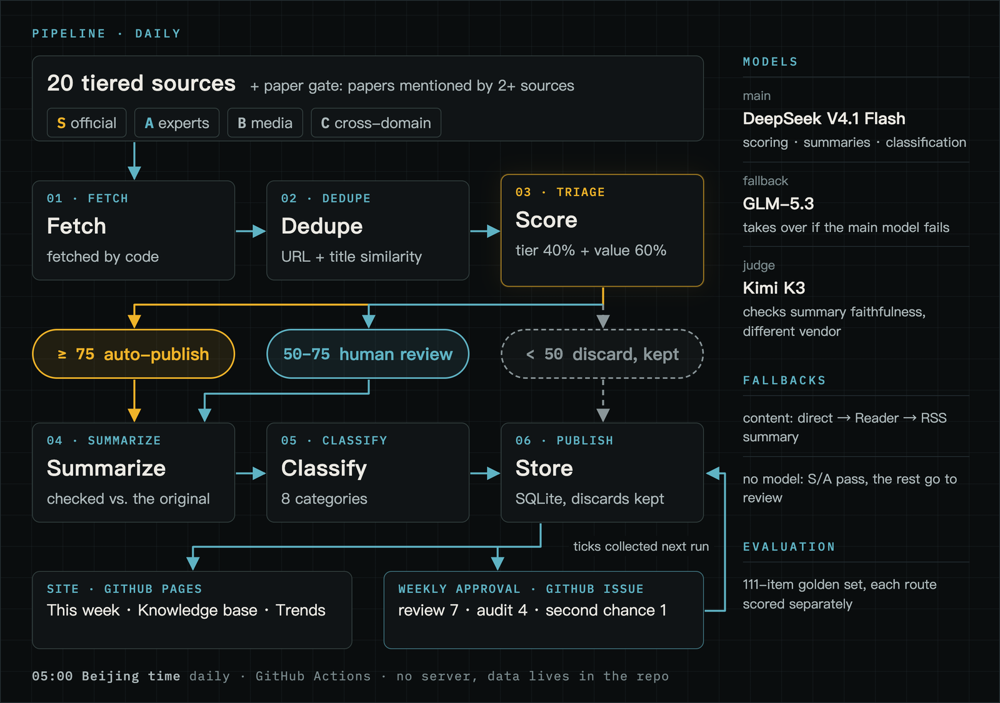

<div align="center">


**AIRadar · A daily scheduled AI-industry intelligence workflow**

Tiered sources → a fixed six-step pipeline → three routes by score (high scores auto-publish · uncertain items go to a weekly human review · low scores are discarded but kept on record) → a searchable AI-industry knowledge base

<p>
<a href="https://wenboxia.github.io/airadar/"><strong>Live site</strong></a> &middot;
<a href="#architecture">Architecture</a> &middot;
<a href="#core-mechanisms">Core mechanisms</a> &middot;
<a href="#evaluation">Evaluation</a> &middot;
<a href="#quick-start">Quick start</a> &middot;
<a href="README.md">中文</a>
</p>

[](https://github.com/wenboxia/airadar/actions/workflows/daily.yml)
[](https://github.com/wenboxia/airadar/commits/main)
[](LICENSE)
[](https://wenboxia.github.io/airadar/)

</div>

<p align="center">
  
  <br>
  <sub>The live site's This Week view (UI in Chinese): top picks plus the full list. In the radar on the right, closer to the center means more trustworthy; color separates time-sensitive news from long-term value.</sub>
</p>

## Architecture

<p align="center">
  
</p>

A human sees one 12-item approval issue a week and ticks it on GitHub:

<p align="center">
  
  <br>
  <sub>The audit and second-chance sections of an approval issue (in Chinese). A filled grey box = ticked. In the audit section a tick means <b>retract</b> — the opposite of the other two. Closing the issue submits; the next run collects it.</sub>
</p>

## Core mechanisms

<table>
<tr>
<td width="33%" valign="top">

### 📡 Source tiers
20 sources in four tiers: **S official 90 / A expert 78 / B media 62 / C cross-domain 48** — the tier is the base score. A paper gate adds arXiv papers only when 2+ sources mention them. Sources evaluated and rejected sit in tier X with written reasons.
<br><sub>[`sources.yaml`](pipeline/sources.yaml)</sub>

</td>
<td width="33%" valign="top">

### ⚖️ Three-dimension score → three routes
The model scores relevance / novelty / long-term value (0.25 / 0.25 / 0.5); marketing copy and knock-offs are capped. The combined score sets the route: **≥ 75 publish · 50–75 review · < 50 discard (kept)**.
<br><sub>[`triage.py`](pipeline/stages/triage.py)</sub>

</td>
<td width="33%" valign="top">

### 🧑‍⚖️ Weekly approval issue
12 items every Monday: **7 review · 4 audit · 1 second chance**. The human retracts mistakes and rescues misses instead of rubber-stamping; audit items are sampled uniformly from auto-published ones; stale issues are labelled before closing, so unticked items never count as rejections.
<br><sub>[`hitl.py`](pipeline/hitl.py)</sub>

</td>
</tr>
<tr>
<td width="33%" valign="top">

### 🛟 Three fallback chains
Content: direct fetch → Jina Reader → RSS summary. Model: DeepSeek → GLM → mark unavailable. Business: with no model, S/A tiers pass and the rest go to review. **Fallbacks only ever tighten.**
<br><sub>[`guards.py`](pipeline/guards.py) · [`llm.py`](pipeline/llm.py)</sub>

</td>
<td width="33%" valign="top">

### 🗂️ Layered memory
This week / knowledge base / trends. Time-sensitive items leave the knowledge base after 14 days; items a human accepted never expire. With less than 21 days of data, no trend verdicts.
<br><sub>[`memory.py`](pipeline/memory.py)</sub>

</td>
<td width="33%" valign="top">

### 🧱 Structural guards
Don't give the model what you don't want it to use: the summarizer never sees the source name. The model used to write the source as the publisher; a written ban didn't stop it, removing the field did.
<br><sub>[`summarize.py`](pipeline/stages/summarize.py)</sub>

</td>
</tr>
</table>

## Evaluation

| What | How | Current result |
|---|---|---|
| **Data integrity** | Field and status checks on every run ([run_eval.py](evals/run_eval.py)) | 0 violations |
| **Scoring and routing** | A 111-item golden set I judged item by item, agreement computed per route ([triage_prompt_eval.py](evals/triage_prompt_eval.py)) | See table below |
| **Classification** | ① Same prompt, same 100 items, classified twice: primary-category agreement ([classify_stability.py](evals/classify_stability.py))<br>② OpenAI / Anthropic's own feed tags as reference ([feed_tag_eval.py](evals/feed_tag_eval.py)) | Agreement 93%<br>Primary hit 88% |
| **Summary faithfulness** | A different vendor's model (Kimi) as judge, 3 votes per item ([judge_hallucination.py](evals/judge_hallucination.py)) | Current model: 1 of 9 sampled summaries unfaithful |
| **Model selection** | Six models compared on the same golden set: completion rate, accuracy, latency, cost ([summary_model_eval.py](evals/summary_model_eval.py) · [model_cost_latency.py](evals/model_cost_latency.py)) | Main model: DeepSeek V4.1 Flash |

The system has three outputs, so the golden set scores the three routes separately rather than with binary precision / recall:

| System decision | Before the scoring change | Now |
|---|---|---|
| Auto-published that I agree with | 62% (37) | 73% (26) |
| Auto-discarded that I'd also discard | 95% (20) | 93% (46) |
| Sent to review that I end up accepting | 28% (54) | 44% (39) |

The review hit rate rose from 28% to 44% not by moving thresholds but by aligning the scoring standard with the inclusion standard: the model first decides whether an item is first-hand, a rehash or marketing copy, and marketing copy is capped by type.

## Quick start

**Live site**: [wenboxia.github.io/airadar](https://wenboxia.github.io/airadar/) (UI in Chinese)

**Run locally** (no API key needed — runs the whole pipeline on the fallback path):

```bash
pip install -r requirements.txt
python3 -m pipeline.main --no-llm --limit 3
cd web && npm install && npm run dev
```

Connecting models and deploying to your own repo: [SETUP.md](SETUP.md) (Chinese).
