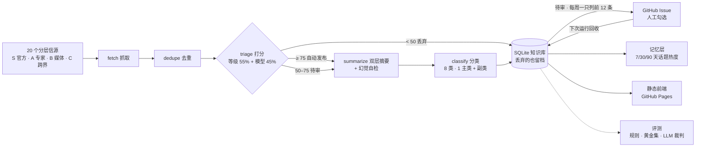

# AIRadar

**每天自动运行的 AI 情报 Agent**：从分层信源抓取 → 打分 → 高分自动发布、拿不准的交给人、低分丢弃留档 → 沉淀成可检索的知识库。

**线上**：https://wenboxia.github.io/airadar/ ｜ 已连续定时运行 **20 天，20 次全部成功**（2026-08-29 → 09-17，GitHub Actions 运行记录）



没有服务器：抓取和打分在 GitHub Actions 里跑，数据提交回仓库，前端是静态页（[D3](docs/decisions.md)）。LLM 不联网，只处理代码抓回来的原文（D2）。

---

## 它解决什么问题

AI 资讯每天几百条，绝大多数是噪声；聚合类产品解决了"看得到"，没解决两件事：**谁可信**，以及**看完能不能留下来**。
AIRadar 的做法是：信源分层决定起点，模型评分决定去向，拿不准的交给人，留下来的按话题和时效沉淀。

## 六个机制

| 机制 | 一句话 | 细节 |
|---|---|---|
| **信源分层** | 按信源是什么定级（官方 90 / 专家 78 / 媒体 62 / 跨界 48），等级决定基础分；评估过但不抓的单列 X 级并写明理由 | [sources.yaml](pipeline/sources.yaml) · D21 D38 D40 |
| **置信度路由 + 人工审批** | 高分自动发、中间分数交给人、低分丢弃留档；每周一张单子 12 条，分三块：待审候选（勾=收）· 自动发布抽查（勾=撤下）· 旧池捞回 | [hitl.py](pipeline/hitl.py) · D6 D37 D44 |
| **跨厂商降级链** | DeepSeek V4.1 Flash → GLM-5.3 → 标记不可用；按错误语义区分临时故障和永久故障，429 不一定是限流 | [llm.py](pipeline/llm.py) · D10 D11 D12 D48 |
| **评测体系** | 规则校验每次必跑；黄金集按三条路由分别评；改打分标准要先离线重打分对照；分类用官网自带标签测；幻觉由另一家模型判 3 次取多数 | [evals/](evals/) · D28 D29 D33 D43 D45 |
| **记忆分层** | 本周 / 知识库 / 趋势三层；时效内容 14 天后退出，数据跨度不足 21 天不给趋势结论 | [memory.py](pipeline/memory.py) · D30 D31 |
| **结构防护优于指令防护** | 不希望模型用的信息，直接不给它——写摘要时不传信源名，比写禁令可靠 | [summarize.py](pipeline/stages/summarize.py) · D34 |

## 运行数据

口径：`data/runs/` 里 2026-08-29 起的 20 次定时运行逐次累加，截至 09-17。这 20 次的主力都是 DeepSeek V4 Pro；09-18 起换成 V4.1 Flash（D48），之后的耗时和 token 量会不同。

| 指标 | 值 |
|---|---|
| 累计抓取 → 去重后进入打分 | 974 → 502 条（筛掉 48%） |
| 三路去向 | 自动发布 227 · 送人工 237 · 自动丢弃 38 |
| LLM 调用 | 1,572 次，310 万 token |
| 切到备用模型 | 62 次（3.9%），20 天里有 19 天发生过 |
| 非致命错误 | 30 个，全部是单个信源抓取失败，没有一次阻塞整条流水线 |
| 单次运行耗时 | 中位 12.1 分钟 |
| 知识库 | 已发布 273 条，其中 37 条时效内容已按规则退出 |
| 回归测试 | 122 个 |

## 评测：方法和真实结果

- **规则校验**：字段完整性、状态合法性，每次运行必跑。当前 580 条 0 违规。
- **黄金集 v2**：111 条人工判断（收录 39 条），按"自动发布 / 自动丢弃 / 送人工"三条路径分别评（D29）：

  | 系统的判断 | 09-16 的打分标准 | 改完之后（V4 Pro 离线重打分） | 现主力 V4.1 Flash（同一批） |
  |---|---|---|---|
  | 自动发布里我认同的 | 62%（37 条） | **64%**（33 条） | 73%（26 条） |
  | 自动丢弃里我也认为该丢的 | 95%（20 条） | **98%**（42 条） | 94%（46 条） |
  | 送审里我最终会收的 | 28%（54 条） | **47%**（36 条） | 44%（39 条） |

  送审命中率从 28% 到 47%（V4 Pro；换成 V4.1 Flash 后同一批是 44%），靠的不是调阈值，是**让打分标准和收录标准变成同一套**（D45）：
  以前 triage 只看"跟四个领域贴不贴"，而我标注时用的是"一手还是转述、是不是营销通稿、有没有可复用的方法"。
  按内容类型看最直观——V4 Pro 判出的 **19 条营销通稿里 17 条被直接丢弃、0 条自动发布**，而我一条都没收。换成 V4.1 Flash 后它判出 25 条，同样 0 条自动发布，但其中 2 条是我收过的——这就是换模型多出来的漏杀（D48）。
  样本还小，区间很宽，只能看方向。旧版 v1（26 条）没有成文标准、收了太多普通论文，已整体作废（D35）。
- **幻觉评测**：Kimi 当裁判，每条判 3 次取多数。8 条抽样判出 2 条不忠实，其中一条是"信源名被写成发布方"，直接促成了 D34。样本很小，只作定性参考。
- **分类**：8 个平铺的类（模型 / Agent 与开发 / 评测 / 安全 / 产品与应用 / 行业动态 / 开源项目 / 研究论文），后两个按链接判定（D43）。两条线都是跑之前定的：

  | 测什么 | 怎么测 | 结果 |
  |---|---|---|
  | 噪声底 | 同一个 prompt 对同样 100 条连分两次，主类一致的比例 | 旧 13 类 73% → 新 8 类 **94%**（验收线 85%）；现主力 V4.1 Flash **93%** |
  | 准确率 | OpenAI / Anthropic 官网 feed 自带的标签当参照，18 个标签共 195 条 | 主类命中 **88%**（V4 Pro 与现主力 V4.1 Flash 相同） |

  94% 里有一部分是类变少了带来的，不全是边界写得好。准确率最低的是 OpenAI 的 Global Affairs 标签——它是 OpenAI 的部门名，
  里面的银行、国家合作案例按我们的边界本该归产品与应用。映射表跑完后没改，改了就是看着答案调标准。

  第一版边界句把"某公司用某模型做出了什么"（Cursor、Warp 这类客户案例）判成了 Agent 与开发。改边界句时**换了一批样本做配对对照**
  （旧 86% → 新 88%，点名的 4 条全部归位），因为改动的依据来自第一批的错例，在同一批上复测等于在测试集上调参。

## 信源是怎么选的

- **评估过 40 多个候选，这一批只收了 2 个**（Sebastian Raschka、Ethan Mollick）。没收的都写了理由：停更、付费墙截断、时间戳造假、量太大、不是 AI 新闻。
- **博客停更的人不收人，收他现在真正在发东西的地方**——人会跳槽，feed 不会（D38）。
- **X 级有三个真实实例**：LangChain 博客（100 条里只有 30 个不同时间戳）、Product Hunt（抓取门槛全过，但只答"今天又上了哪些套壳"）、按提交时间抓的 arXiv（一度占自动发布 44%，入口本身就错了，D36）。
- **信源体检**按每个信源自己的更新节奏报警，并读取云端运行记录——上一版对 4 个真实问题全部显示"正常"，其中包括 Anthropic 镜像漏掉了 Fable 5.1 的发布文（D41）。

## 黄金集是怎么标的

**收不收，100 条都是我自己口头决定的**：边和 ChatGPT 语音聊天边标，它念资料、查原文，我说收不收、为什么，它代填表格。
被评测的系统本身就是模型在打分，标准答案不能再让模型来给，否则就成了模型评模型。过程里的事实如实记录（D42）：

- ChatGPT 代填的理由，100 条里 94 条加了我没说过的内容，所以理由改为从聊天记录里逐条提取我的原话，
  再补上它提到、我没说到的具体事实，**每个补充点都标了出处**（`evals/golden_set/golden_v2_extraction.json`）
- 42 条在我表态前它先说了"建议收 / 不收"；其中 4 条我明确说"就按你的理由"——去掉这 4 条，三项指标基本不变（自动发布 64%、自动丢弃 95%、送审 27%）
- 同一批里有 9 条是旧版 v1 标过的，两次判断 8 条一致

写资料的模型（Kimi / GLM）刻意和负责打分的 DeepSeek 不是同一家。标准和版本记录见 [evals/golden_set/README.md](evals/golden_set/README.md)。

## 设计决策

[docs/decisions.md](docs/decisions.md) 记录了 48 条决策，开头有按五段组织的故事线。最值得先看的三条：

- **D28** 人工审批覆盖了系统原判，评测变成"人评人自己"——之后系统判断和人的判断分字段存储，永不互相覆盖
- **D29** 三路输出不能用二分类指标评，否则会把"我不确定"算成"我觉得该收"
- **D34** 能从上下文里删掉的信息，就不要靠指令禁止使用
- **D44** 逐条点批准会让人退化成橡皮图章（Anthropic 自己的遥测：权限弹窗通过率 93%）——所以人的动作改成"撤下错的、捞回漏的"
- **D47** 三家模型选型的决定性差异不是准确率，是完成率：Kimi 111 条里 73 条被打回，后来查明是账号并发上限只有 1
- **D48** 主力从 V4 Pro 换成 V4.1 Flash——理由是 Pro 要退役，不是 Flash 更准；代价（打分多漏 2 条、10 篇摘要里 1 篇意思反了）如实写在 [eval_report.md](docs/eval_report.md)

3 分钟演示路径：[docs/demo.md](docs/demo.md)

## 本地运行

```bash
pip install -r requirements.txt
python3 -m pipeline.main --no-llm --limit 3   # 不需要 API key，走降级路径跑通全流程（会写入 data/）
python3 -m unittest discover evals            # 122 个回归测试
```

前端：`cd web && npm install && npm run dev`。完整命令见 [CLAUDE.md](CLAUDE.md)，配置见 [SETUP.md](SETUP.md)。
