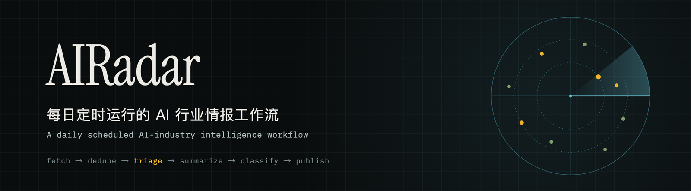
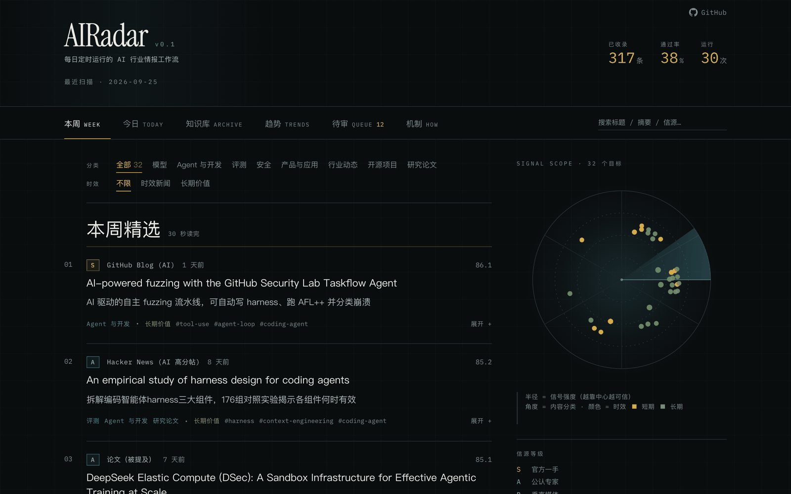
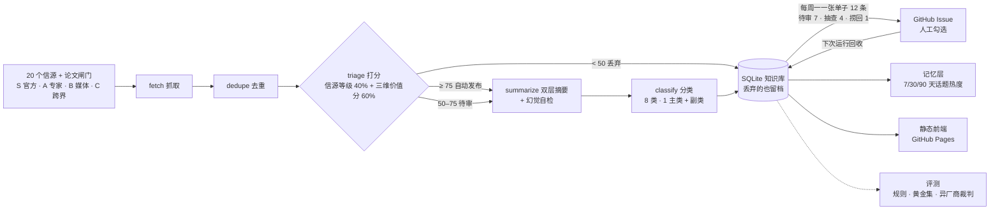
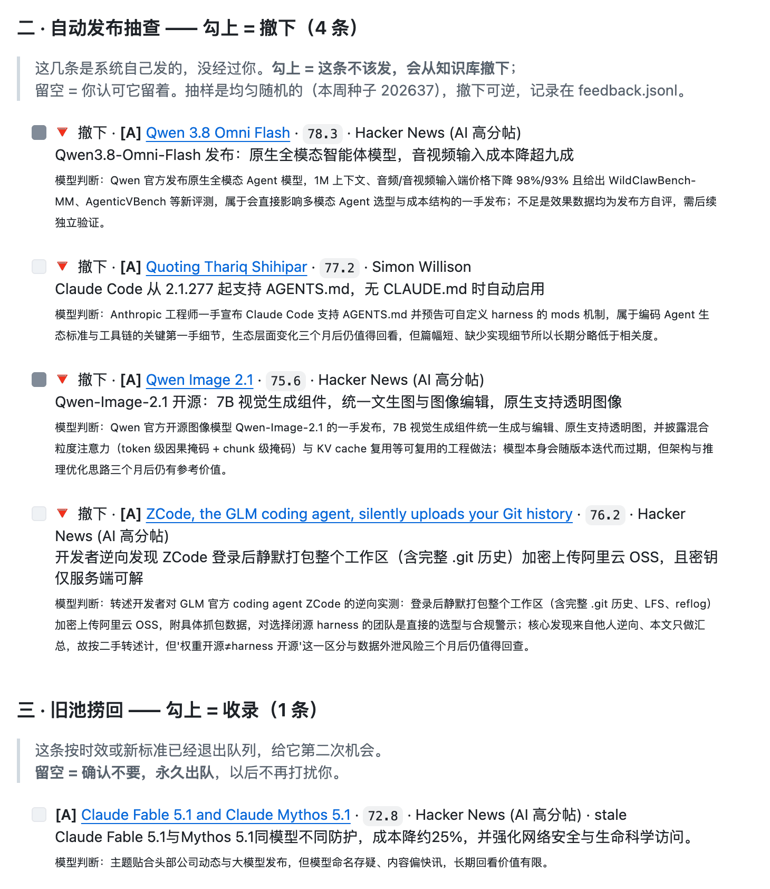
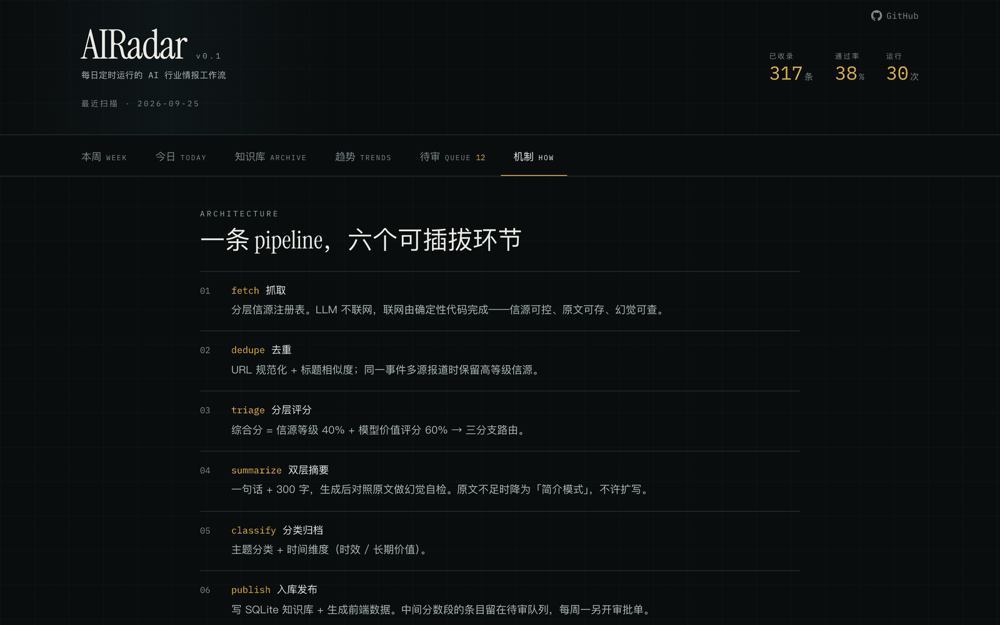
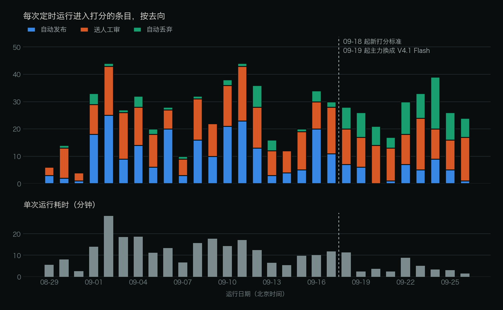

<div align="center">



**AIRadar · 每日定时运行的 AI 行业情报工作流**

分层信源 → 固定六步流水线 → 按分数三路分流（高分自动发布 · 拿不准的每周交人审批 · 低分丢弃留档）→ 可检索的 AI 行业知识库

<p>
<strong>中文</strong> &middot;
<a href="README.en.md">English</a> &middot;
<a href="https://wenboxia.github.io/airadar/"><strong>在线体验</strong></a> &middot;
<a href="#快速上手">快速上手</a> &middot;
<a href="#架构">架构</a> &middot;
<a href="#评测">评测</a> &middot;
<a href="#运行数据">运行数据</a> &middot;
<a href="docs/decisions.md">设计决策</a>
</p>

[](https://github.com/wenboxia/airadar/actions/workflows/daily.yml)
[](https://github.com/wenboxia/airadar/commits/main)
[](LICENSE)
[](https://wenboxia.github.io/airadar/)

</div>

<p align="center">
  
  <br>
  <sub>线上站点「本周」页：精选 + 完整列表。右栏雷达里越靠中心越可信，颜色区分时效新闻和长期价值。数据截至 2026-09-25 的定时运行。</sub>
</p>

<details>
<summary><kbd>目录</kbd></summary>

- [它怎么工作](#它怎么工作)
- [用到的模型](#用到的模型)
- [它解决什么问题](#它解决什么问题)
- [六个机制](#六个机制)
- [架构](#架构)
- [评测](#评测)
- [运行数据](#运行数据)
- [AIRadar 不是什么](#airadar-不是什么)
- [快速上手](#快速上手)
- [自己验证](#自己验证)
- [常见问题](#常见问题)
- [设计决策](#设计决策)
- [相关项目](#相关项目)

</details>

## 它怎么工作

| 步骤 | 做什么 | 例子（09-25 那次运行） |
|---|---|---|
| **01 每天抓取、打分** | GitHub Actions 每天北京时间 05:00 定时触发，从 20 个分层信源和一个论文闸门抓回原文，模型给每条打三维价值分 | 抓到 48 条，去重后 24 条进入打分 |
| **02 按分数三路分流** | 综合分 = 信源等级 40% + 价值分 60%。≥ 75 自动发布，50–75 送人工审，< 50 丢弃但留档 | 自动发布 1 · 送审 16 · 丢弃 7 |
| **03 每周一由人终审** | 每周一开一张 12 条的 GitHub Issue：待审候选 7 条（勾 = 收）· 自动发布抽查 4 条（勾 = 撤下）· 旧池捞回 1 条。关闭 issue 即提交，下次运行回收 | 第 4 号审批单：收 2 条、撤下 2 条（截图见[架构](#架构)） |

## 用到的模型

| 角色 | 模型 | 做什么 |
|---|---|---|
| 主力 | DeepSeek V4.1 Flash | 打分、写摘要、分类、摘要自检 |
| 备用 | GLM-5.3 | 主力永久性故障时自动接管，换一家厂商兜底 |
| 裁判 | Kimi K3 | 只用于评测：核验摘要是否忠于原文，每条判 3 次取多数。故意和主力不同家，避免模型给自己打高分 |

## 它解决什么问题

| 看 AI 资讯的常见问题 | AIRadar 的做法 |
|---|---|
| 每天几百条，不知道谁可信 | 信源按「它是什么」定级（官方 / 专家 / 媒体 / 跨界），等级决定基础分；评估过但不收的也写进注册表并写明理由 |
| 全自动会错发，全人工看不过来 | 高分自动发，拿不准的交给人，人每周只看 12 条；人的动作是撤下错的、捞回漏的，不是逐条盖章 |
| 看完就忘 | 发布的内容沉淀进可搜索的知识库；时效新闻 14 天后退出，长期价值的留下 |
| 「效果变好了」拿不出证据 | 111 条本人判断的黄金集，自动发布 / 自动丢弃 / 送审三条路径分别算认同率 |

## 六个机制

<table>
<tr>
<td width="33%" valign="top">

### 📡 信源分层
20 个信源 + 1 个论文闸门，分 **S 官方 90 / A 专家 78 / B 媒体 62 / C 跨界 48** 四级，等级就是基础分。3 个评估后决定不抓的单列 X 级并写明理由。
<br><sub>[`sources.yaml`](pipeline/sources.yaml)</sub>

</td>
<td width="33%" valign="top">

### ⚖️ 三维价值分 → 三路
模型按相关度 / 新颖度 / 长期价值打分（0.25 / 0.25 / 0.5），营销通稿、仿造品封顶。综合分决定去向：**≥ 75 发布 · 50–75 送审 · < 50 丢弃留档**。
<br><sub>[`triage.py`](pipeline/stages/triage.py)</sub>

</td>
<td width="33%" valign="top">

### 🧑‍⚖️ 每周审批单
每周一 12 条：**待审 7 · 抽查 4 · 捞回 1**。抽查从自动发布里均匀随机抽，是唯一无偏的人工反馈；过期单子先打标签再关，没勾的不算否决。
<br><sub>[`hitl.py`](pipeline/hitl.py)</sub>

</td>
</tr>
<tr>
<td width="33%" valign="top">

### 🛟 三条降级链
内容：直抓 → Jina Reader → RSS 简介。模型：DeepSeek → GLM → 标记不可用。业务：模型不可用时 S/A 级放行、其余送审。**降级只往收紧的方向走。**
<br><sub>[`guards.py`](pipeline/guards.py) · [`llm.py`](pipeline/llm.py)</sub>

</td>
<td width="33%" valign="top">

### 🗂️ 分层记忆
本周 / 知识库 / 趋势三层。时效内容 14 天后退出知识库，人工勾收的永不过期；数据跨度不足 21 天，不给趋势结论。
<br><sub>[`memory.py`](pipeline/memory.py)</sub>

</td>
<td width="33%" valign="top">

### 🧱 结构防护
不希望模型用的信息，直接不给它：写摘要时不传信源名。模型曾把信源名写成发布方，写禁令挡不住，删掉之后问题消失。
<br><sub>[`summarize.py`](pipeline/stages/summarize.py)</sub>

</td>
</tr>
</table>

## 架构



没有服务器：抓取和打分在 GitHub Actions 里跑，数据提交回仓库，前端是静态页。LLM 不联网，只处理代码抓回来的原文。

> **为什么叫工作流，不叫 Agent**
>
> 按 Anthropic《[Building effective agents](https://www.anthropic.com/engineering/building-effective-agents)》的分法，步骤由代码预先写好的是工作流，由模型自己决定流程和工具的才是 agent。
> AIRadar 的步骤顺序写死在 [`pipeline/main.py`](pipeline/main.py)，模型只做打分、摘要、分类、自检，不调用工具，也没有循环，是**提示链 + 路由**。
> 这是刻意的：固定步骤才能逐段评测、按规则降级。（[D49](docs/decisions.md#d49)）

<p align="center">
  
  <br>
  <sub>真实的第 4 号审批单（截取抽查和捞回两块），灰色实心方框 = 勾上。抽查这块勾上是「撤下」，和另外两块相反。关闭 issue 即提交，下次运行回收。</sub>
</p>

<details>
<summary>网站「机制」页截图</summary>
<br>

</details>

## 评测

| 测什么 | 怎么测 | 当前结果 |
|---|---|---|
| **数据完整性** | 字段、状态合法性，每次运行必跑（[run_eval.py](evals/run_eval.py)） | 824 条，0 违规（09-25） |
| **打分与路由** | 111 条本人判断的黄金集，三条路径分别算认同率（[triage_prompt_eval.py](evals/triage_prompt_eval.py)） | 见下表 |
| **分类** | ① 同一 prompt 对同样 100 条连分两次，看主类一致率，当噪声底（[classify_stability.py](tools/classify_stability.py)）<br>② 拿 OpenAI / Anthropic 官网自带的标签当参照（[feed_tag_eval.py](evals/feed_tag_eval.py)） | 一致率 93%（V4.1 Flash）<br>主类命中 88%（195 条样本） |
| **摘要忠实度** | 另一家模型（Kimi）当裁判，每条判 3 次取多数（[judge_hallucination.py](evals/judge_hallucination.py) · [summary_model_eval.py](evals/summary_model_eval.py)） | 早期 8 条抽样判出 2 条不忠实；选型时 V4 Pro 0/8、V4.1 Flash 1/9 |
| **模型选型** | 六个型号在同一批黄金集上配对对比：完成率、准确率、延迟、成本（[eval_report.md](docs/eval_report.md)） | 主力选 V4.1 Flash：分类与 V4 Pro 打平、快约 3 倍，打分多漏 2 条 |

**黄金集 v2**：111 条人工判断（收录 39 条）。系统是三路输出，所以三条路径分开评，不套二分类的精确率 / 召回率：

| 系统的判断 | 09-16 的打分标准 | 新标准 · V4 Pro | 新标准 · V4.1 Flash（现主力） |
|---|---|---|---|
| 自动发布里我认同的 | 62%（37 条） | **64%**（33 条） | 73%（26 条） |
| 自动丢弃里我也认为该丢的 | 95%（20 条） | **98%**（42 条） | 93%（46 条） |
| 送审里我最终会收的 | 28%（54 条） | **47%**（36 条） | 44%（39 条） |

送审命中率从 28% 升到 44–47%，靠的不是调阈值，而是让打分标准和收录标准变成同一套：以前打分只看「跟关注领域贴不贴」，我标注时看的是「一手还是转述、是不是营销通稿、有没有可复用的方法」。
换成 V4.1 Flash 后漏杀从 1 条变成 3 条（都只差一点到送审线），没有为此调门槛——那等于在测试集上调参。样本小，区间约 ±15 个百分点，只能看方向。（[D45](docs/decisions.md#d45) · [D48](docs/decisions.md#d48)）

<details>
<summary><strong>黄金集是怎么标的（含 AI 辅助的披露）</strong></summary>
<br>

**收不收，100 条都是我自己口头决定的**：边和 ChatGPT 语音聊天边标，它念资料、查原文，我说收不收、为什么，它代填表格。另外 11 条复用自作废的 v1。
被评测的系统本身就是模型在打分，标准答案不能再让模型来给，否则就成了模型评模型。过程里的事实如实记录：

- ChatGPT 代填的理由，100 条里 94 条加了我没说过的内容，所以理由改为从聊天记录里逐条提取我的原话，
  再补上它提到、我没说到的具体事实，**每个补充点都标了出处**（[`golden_v2_extraction.json`](evals/golden_set/golden_v2_extraction.json)）
- 42 条它说过收不收的倾向，其中 33 条是在我表态之前（`ai_recommended_first`）；4 条我明确说「就按你的理由」。去掉这 4 条，按 09-16 的打分标准算，三项指标基本不变（自动发布 64%、自动丢弃 95%、送审 27%）
- 同一批里有 9 条是旧版 v1 标过的，两次判断 8 条一致

写资料的模型（Kimi / GLM）刻意和负责打分的 DeepSeek 不是同一家。收录标准和版本记录见 [`evals/golden_set/README.md`](evals/golden_set/README.md)。（[D42](docs/decisions.md#d42)）

</details>

<details>
<summary><strong>分类评测细节</strong></summary>
<br>

8 个平铺的类：模型 / Agent 与开发 / 评测 / 安全 / 产品与应用 / 行业动态 / 开源项目 / 研究论文，后两个按链接判定。两条验收线都是跑之前定的：

| 测什么 | 怎么测 | 结果 |
|---|---|---|
| 噪声底 | 同一个 prompt 对同样 100 条连分两次，主类一致的比例 | 旧 13 类 73% → 新 8 类 **94%**（验收线 85%）；现主力 V4.1 Flash **93%** |
| 准确率 | OpenAI / Anthropic 官网 feed 自带的标签当参照，18 个标签共 195 条 | 主类命中 **88%**（V4 Pro 与 V4.1 Flash 相同） |

94% 里有一部分是类变少了带来的，不全是边界写得好。第一版（84%）准确率最低的是 OpenAI 的 Global Affairs 标签（33%）——它是 OpenAI 的部门名，
里面的银行、国家合作案例按我们的边界本该归产品与应用。映射表跑完后没改，改了就是看着答案调标准。改完边界后的两次（88%）里最低的换成了 AI Adoption。

第一版边界句把「某公司用某模型做出了什么」（Cursor、Warp 这类客户案例）判成了 Agent 与开发。改边界句时**换了一批样本做配对对照**
（旧 86% → 新 88%，点名的 4 条全部归位），因为改动的依据来自第一批的错例，在同一批上复测等于在测试集上调参。（[D43](docs/decisions.md#d43)）

</details>

## 运行数据

数据截至 2026-09-25（UTC）的定时运行，由 [`tools/run_stats.py`](tools/run_stats.py) 从 `data/runs/` 逐次累加生成，只算云端定时运行、不算本地调试；要刷新就重跑它。

| 指标 | 值 |
|---|---|
| 定时运行 | 29 次，全部成功（2026-08-29 → 09-25，GitHub Actions 记录） |
| 累计抓取 → 去重后进入打分 | 1,457 → 746 条（筛掉 49%） |
| 三路去向 | 自动发布 268 · 送审 355 · 自动丢弃 123 |
| LLM 调用 | 2,158 次，435 万 token |
| 切到备用模型 | 77 次（3.6%），29 次运行里 27 次发生过 |
| 非致命错误 | 30 个，全部是单个信源抓取失败，没有一次阻塞整条流水线 |
| 单次运行耗时 | 中位 9.8 分钟：V4 Pro 时期 21 次中位 11.8 分钟，V4.1 Flash 时期 8 次中位 3.2 分钟 |
| 知识库 | 已发布 317 条，其中 82 条时效内容已按规则退出 |
| 回归测试 | 128 个 |

<p align="center">
  
  <br>
  <sub>北京时间 09-18 起启用新打分标准，09-19 起主力换成 V4.1 Flash。两件事只隔一次运行，所以之后丢弃变多、耗时变短，不能只算在换模型头上。</sub>
</p>

## AIRadar 不是什么

| 不是 | 为什么 |
|---|---|
| 不是 Agent | 步骤由代码写死，模型不调用工具，也没有循环（[D49](docs/decisions.md#d49)） |
| 不联网搜索 | 抓取由代码按信源白名单完成，模型只处理抓回来的原文：原文可存，幻觉可查（[D2](docs/decisions.md#d2)） |
| 不是聊天问答 | 纯静态站，没有后端；做对话问答要加服务器，破坏零服务器架构（[D3](docs/decisions.md#d3)） |
| 不是全自动 | 拿不准的交给人，人每周只看 12 条（[D44](docs/decisions.md#d44)） |
| 不是多智能体编辑部 | 评估过：真正的瓶颈是审批量和打分口味，不是缺一个会自己跑的记者（[D50](docs/decisions.md#d50)） |
| 不按作者抓论文 | 量过：4 位知名作者近 90 天 18 篇论文，没有一篇有人在讨论；论文只收被别处提到的（[D36](docs/decisions.md#d36)） |

## 快速上手

**看**：打开[在线站点](https://wenboxia.github.io/airadar/)，有本周 / 今日 / 知识库 / 趋势 / 待审 / 机制六个视图。

**审**：带 `airadar-approval` 标签的 issue 就是每周审批单，[历史审批单在这里](https://github.com/wenboxia/airadar/issues?q=label%3Aairadar-approval)。

**跑**：

```bash
pip install -r requirements.txt
python3 -m pipeline.main --no-llm --limit 3   # 不需要 API key，走降级路径跑通全流程（会写入 data/）
python3 -m unittest discover evals            # 128 个回归测试
cd web && npm install && npm run dev          # 前端
```

<details>
<summary>自己部署一份</summary>
<br>

1. Fork 本仓库，在 Settings → Secrets and variables → Actions 里填三个模型角色的配置：主力 `AIRADAR_LLM_*`、备用 `AIRADAR_FALLBACK_*`、裁判 `AIRADAR_JUDGE_*`（接口地址和模型名放 Variables，key 放 Secrets）
2. Settings → Pages 的来源选 GitHub Actions
3. `daily.yml` 每天定时跑：抓取 → 写库 → 构建 → 部署，一条工作流串完

完整配置和故障排查见 [SETUP.md](SETUP.md)，全部命令见 [CLAUDE.md](CLAUDE.md)。

</details>

## 自己验证

README 里的数字都能在仓库里复算：

```bash
python3 tools/run_stats.py --check-gh   # 复算「运行数据」表，并核对 GitHub 上的定时运行记录
python3 evals/run_eval.py               # 规则校验 + 黄金集三路径（只评已落库的判断）
python3 evals/triage_prompt_eval.py --replay evals/results/triage-prompt-20260918-143857-deepseek-flash.jsonl \
        --weights 0.4,0.25,0.25,0.5     # 零成本重放 V4.1 Flash 在黄金集上的打分，得到上表最后一列
```

## 常见问题

<details>
<summary><strong>为什么不用 LangGraph？</strong></summary>
<br>
拓扑是一条线性链加一个条件路由，LangGraph 的价值（循环图、检查点、多 agent 共享状态）在这里用不上，引入它只是拿框架复杂度换一个名词。编排逻辑手写在 <code>pipeline/main.py</code>，约 30 行。（<a href="docs/decisions.md#d1">D1</a>）
</details>

<details>
<summary><strong>为什么不让模型自己上网搜？</strong></summary>
<br>
可控、可测、可溯源：信源由白名单决定；幻觉率的前提是手里有原文，摘要才能对照原文核验；每条内容都标来源和原文链接。（<a href="docs/decisions.md#d2">D2</a>）
</details>

<details>
<summary><strong>为什么每周审批，不是每天？</strong></summary>
<br>
「每天审批」从没真正发生过：08-29 开的审批单一直没关，之后 18 天送审的内容全部沉在库里。人的注意力刷新频率决定审批频率，而不是数据到达的频率。（<a href="docs/decisions.md#d37">D37</a>）
</details>

<details>
<summary><strong>为什么不做成多智能体 / 数字员工？</strong></summary>
<br>
流水线本身就像编辑部分工，但每个岗位的任务都是固定的，固定步骤才能逐项评测。量下来真正的瓶颈是审批量和打分口味：黄金集里被否的送审内容，理由几乎都是对文本本身的判断，靠自主深挖改变不了。如果以后要加自主性，先做离线对照：同样的工具，固定步骤补证据 vs agent 自己决定查什么。（<a href="docs/decisions.md#d50">D50</a>）
</details>

<details>
<summary><strong>数字是怎么来的？</strong></summary>
<br>
运行数据由 <code>tools/run_stats.py</code> 从 <code>data/runs/</code> 生成；评测结果逐次存在 <code>evals/results/</code>；黄金集的标注标准和来源在 <code>evals/golden_set/</code>。见上面的「自己验证」。
</details>

## 设计决策

[docs/decisions.md](docs/decisions.md) 记录了 50 条决策（背景 / 选项 / 决定 / 为什么），开头有按五段组织的故事线。3 分钟演示路径见 [docs/demo.md](docs/demo.md)。

<details>
<summary><strong>最值得先看的 6 条</strong></summary>
<br>

| 问题 | 决定 | 编号 |
|---|---|---|
| 人工审批覆盖了系统原判，评测变成「人评人自己」 | 系统判断和人的判断分字段存，永不互相覆盖 | [D28](docs/decisions.md#d28) |
| 三路输出套二分类指标，会把「我不确定」算成「我觉得该收」 | 三条路径分开评 | [D29](docs/decisions.md#d29) |
| 写禁令挡不住模型把信源名写成发布方 | 能从上下文删掉的信息，就别给模型 | [D34](docs/decisions.md#d34) |
| 逐条点批准会退化成橡皮图章（Anthropic 遥测：权限弹窗通过率 93%） | 人只撤下错的、捞回漏的 | [D44](docs/decisions.md#d44) |
| 打分标准和收录标准长期是两套 | 打分先判内容类型，营销通稿按类型封顶 | [D45](docs/decisions.md#d45) |
| 选型报告差点写成一张准确率排行榜 | 先看完成率，只在都跑成功的样本上配对比较 | [D47](docs/decisions.md#d47) |

</details>

## 相关项目

- **[两仪 · Liangyi](https://github.com/wenboxia/liangyi)**：One idea, two opposing expert views, one synthesized decision. A Claude Code workflow for adversarial product development — inspired by the I Ching.
- **[VoyageGuard](https://github.com/wenboxia/VoyageGuard)**：AI Agent 驱动的出行气象风险决策工具，专注飞机与船只场景，LLM 推理 + 规则引擎安全网双重保障。

## License

[MIT](LICENSE) © 2026 wenboxia

<p align="center"><sub>数据由 pipeline 自动生成，人只通过审批渠道介入。</sub></p>
