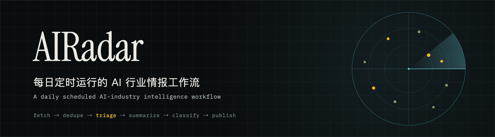
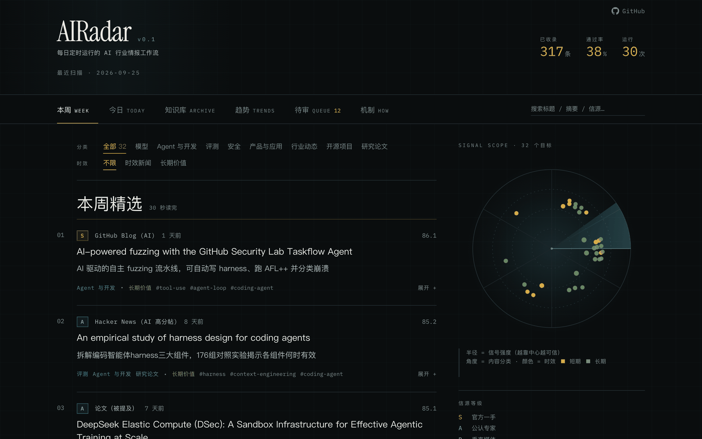
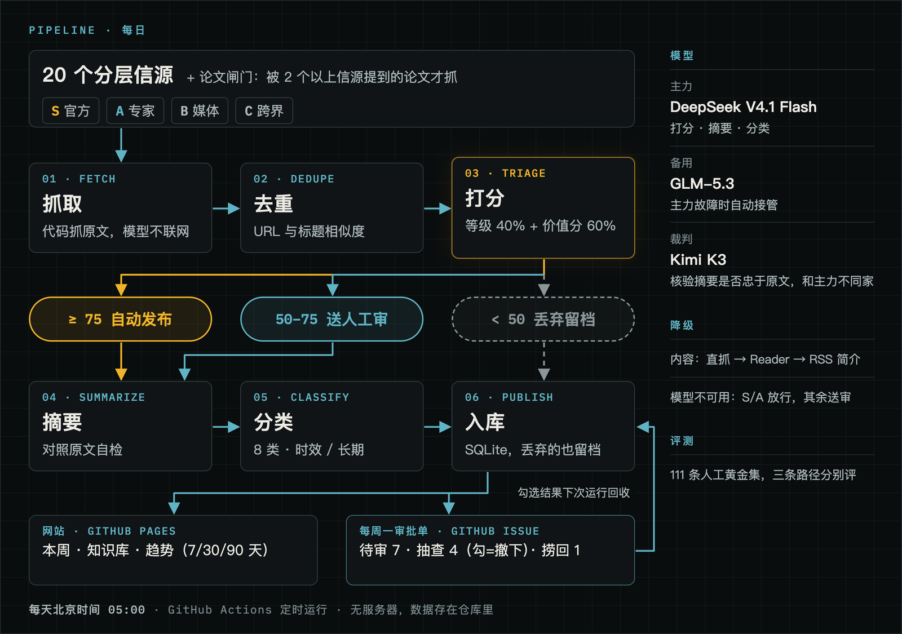
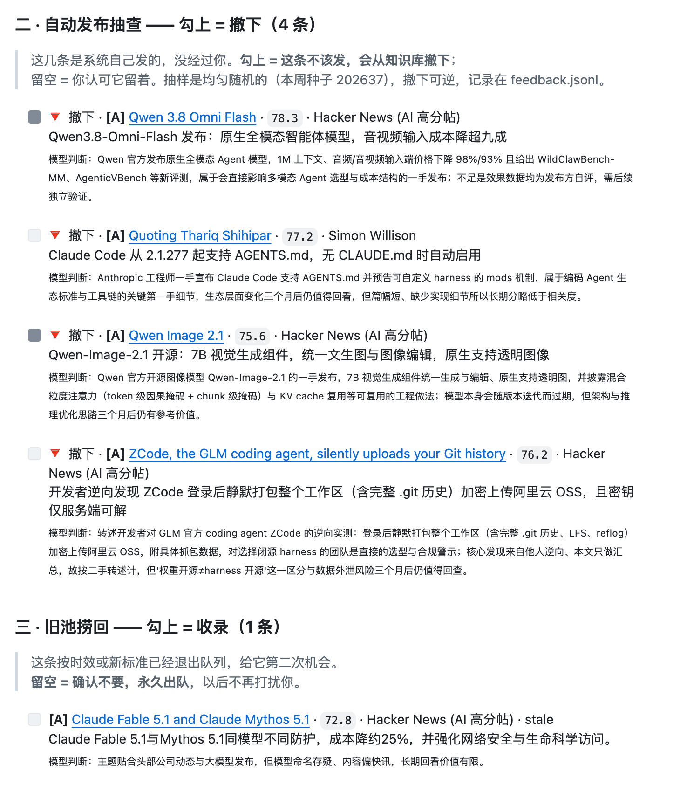

<div align="center">



**AIRadar · 每日定时运行的 AI 行业情报工作流**

分层信源 → 固定六步流水线 → 按分数三路分流（高分自动发布 · 拿不准的每周交人审批 · 低分丢弃留档）→ 可检索的 AI 行业知识库

<p>
<a href="https://wenboxia.github.io/airadar/"><strong>在线体验</strong></a> &middot;
<a href="#架构">架构</a> &middot;
<a href="#核心机制">核心机制</a> &middot;
<a href="#评测">评测</a> &middot;
<a href="#快速上手">快速上手</a> &middot;
<a href="README.en.md">English</a>
</p>

[](https://github.com/wenboxia/airadar/actions/workflows/daily.yml)
[](https://github.com/wenboxia/airadar/commits/main)
[](LICENSE)
[](https://wenboxia.github.io/airadar/)

</div>

<p align="center">
  
  <br>
  <sub>线上站点「本周」页：精选 + 完整列表。右栏雷达里越靠中心越可信，颜色区分时效新闻和长期价值。</sub>
</p>

## 架构

<p align="center">
  
</p>

人每周只看一张 12 条的审批单，在 GitHub Issue 里勾选：

<p align="center">
  
  <br>
  <sub>审批单里的抽查和捞回两块，灰色实心方框 = 勾上。抽查这块勾上是「撤下」，和另外两块相反。关闭 issue 即提交，下次运行回收。</sub>
</p>

## 核心机制

<table>
<tr>
<td width="33%" valign="top">

### 📡 信源分层
20 个信源分 **S 官方 90 / A 专家 78 / B 媒体 62 / C 跨界 48** 四级，等级就是基础分。另有一道论文闸门：被 2 个以上信源提到的论文才抓。评估过但决定不抓的信源单列 X 级，写明理由。
<br><sub>[`sources.yaml`](pipeline/sources.yaml)</sub>

</td>
<td width="33%" valign="top">

### ⚖️ 三维价值分 → 三路
模型按相关度 / 新颖度 / 长期价值打分（0.25 / 0.25 / 0.5），营销通稿、仿造品封顶。综合分决定去向：**≥ 75 发布 · 50–75 送审 · < 50 丢弃留档**。
<br><sub>[`triage.py`](pipeline/stages/triage.py)</sub>

</td>
<td width="33%" valign="top">

### 🧑‍⚖️ 每周审批单
每周一 12 条：**待审 7 · 抽查 4 · 捞回 1**。人只撤下错的、捞回漏的，不逐条盖章；抽查从自动发布里均匀随机抽；过期单子先打标签再关，没勾的不算否决。
<br><sub>[`hitl.py`](pipeline/hitl.py)</sub>

</td>
</tr>
<tr>
<td width="33%" valign="top">

### 🛟 三条降级链
内容：直抓 → Jina Reader → RSS 简介。模型：DeepSeek → GLM → 标记不可用。业务：模型不可用时 S/A 级放行、其余送审。**降级只往收紧的方向走。**
<br><sub>[`guards.py`](pipeline/guards.py) · [`llm.py`](pipeline/llm.py)</sub>

</td>
<td width="33%" valign="top">

### 🗂️ 分层记忆
本周 / 知识库 / 趋势三层。时效内容 14 天后退出知识库，人工勾收的永不过期；数据跨度不足 21 天，不给趋势结论。
<br><sub>[`memory.py`](pipeline/memory.py)</sub>

</td>
<td width="33%" valign="top">

### 🧱 结构防护
不希望模型用的信息，直接不给它：写摘要时不传信源名。模型曾把信源名写成发布方，写禁令挡不住，删掉之后问题消失。
<br><sub>[`summarize.py`](pipeline/stages/summarize.py)</sub>

</td>
</tr>
</table>

## 评测

| 测什么 | 怎么测 | 当前结果 |
|---|---|---|
| **数据完整性** | 字段、状态合法性，每次运行必跑（[run_eval.py](evals/run_eval.py)） | 0 违规 |
| **打分与路由** | 111 条由我逐条判断的黄金集，三条路径分别算认同率（[triage_prompt_eval.py](evals/triage_prompt_eval.py)） | 见下表 |
| **分类** | ① 同一 prompt 对同样 100 条连分两次，看主类一致率（[classify_stability.py](evals/classify_stability.py)）<br>② 拿 OpenAI / Anthropic 官网自带的标签当参照（[feed_tag_eval.py](evals/feed_tag_eval.py)） | 一致率 93%<br>主类命中 88% |
| **摘要忠实度** | 另一家模型（Kimi）当裁判，每条判 3 次取多数（[judge_hallucination.py](evals/judge_hallucination.py)） | 现主力抽样 9 篇，1 篇不忠实 |
| **模型选型** | 六个型号在同一批黄金集上对比完成率、准确率、延迟、成本（[summary_model_eval.py](evals/summary_model_eval.py) · [model_cost_latency.py](evals/model_cost_latency.py)） | 主力选 DeepSeek V4.1 Flash |

系统是三路输出，所以黄金集按三条路径分开评，不套二分类的精确率 / 召回率：

| 系统的判断 | 改打分标准前 | 现在 |
|---|---|---|
| 自动发布里我认同的 | 62%（37 条） | 73%（26 条） |
| 自动丢弃里我也认为该丢的 | 95%（20 条） | 93%（46 条） |
| 送审里我最终会收的 | 28%（54 条） | 44%（39 条） |

送审命中率从 28% 提到 44%，办法不是调阈值，而是让打分标准和收录标准一致：先判断内容是一手发布、二手转述还是营销通稿，营销通稿按类型封顶。

## 快速上手

**在线体验**：打开 [wenboxia.github.io/airadar](https://wenboxia.github.io/airadar/)

**本地运行**（不需要 API key，走降级路径跑通全流程）：

```bash
pip install -r requirements.txt
python3 -m pipeline.main --no-llm --limit 3
cd web && npm install && npm run dev
```

接入模型、部署到自己的仓库见 [SETUP.md](SETUP.md)。

## 相关项目

- **[两仪 · Liangyi](https://github.com/wenboxia/liangyi)**：One idea, two opposing expert views, one synthesized decision. A Claude Code workflow for adversarial product development — inspired by the I Ching.
- **[VoyageGuard](https://github.com/wenboxia/VoyageGuard)**：AI Agent 驱动的出行气象风险决策工具，专注飞机与船只场景，LLM 推理 + 规则引擎安全网双重保障。

## License

[MIT](LICENSE) © 2026 wenboxia
